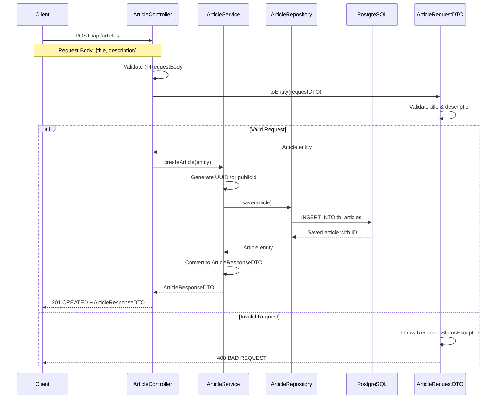
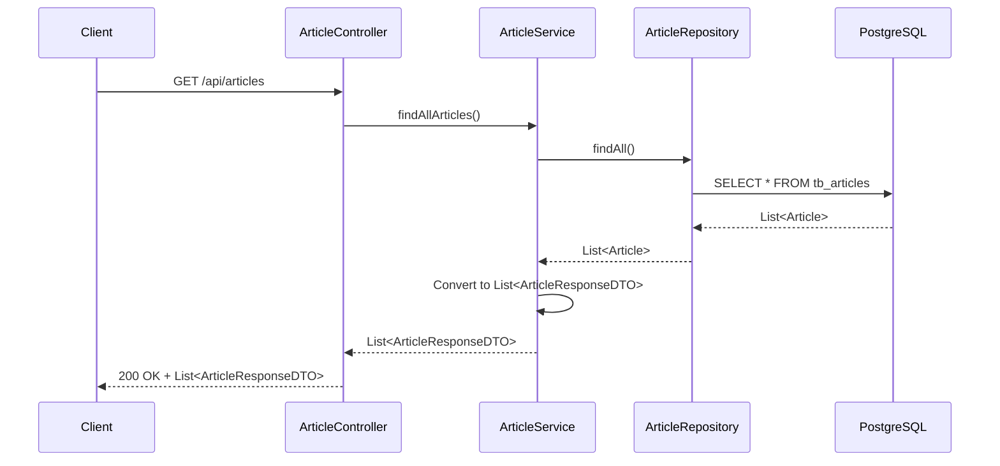
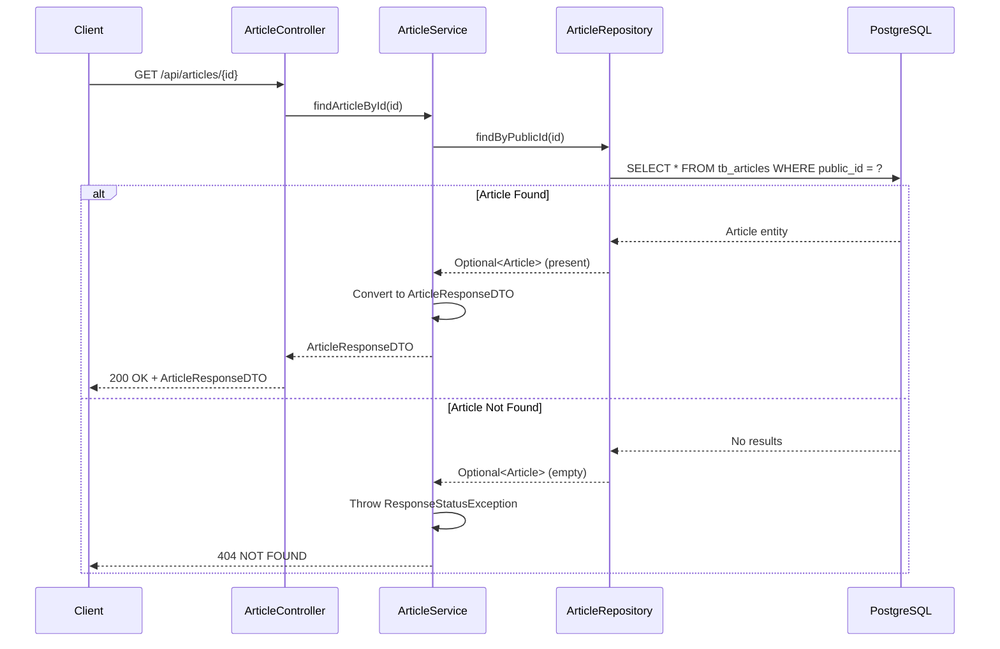
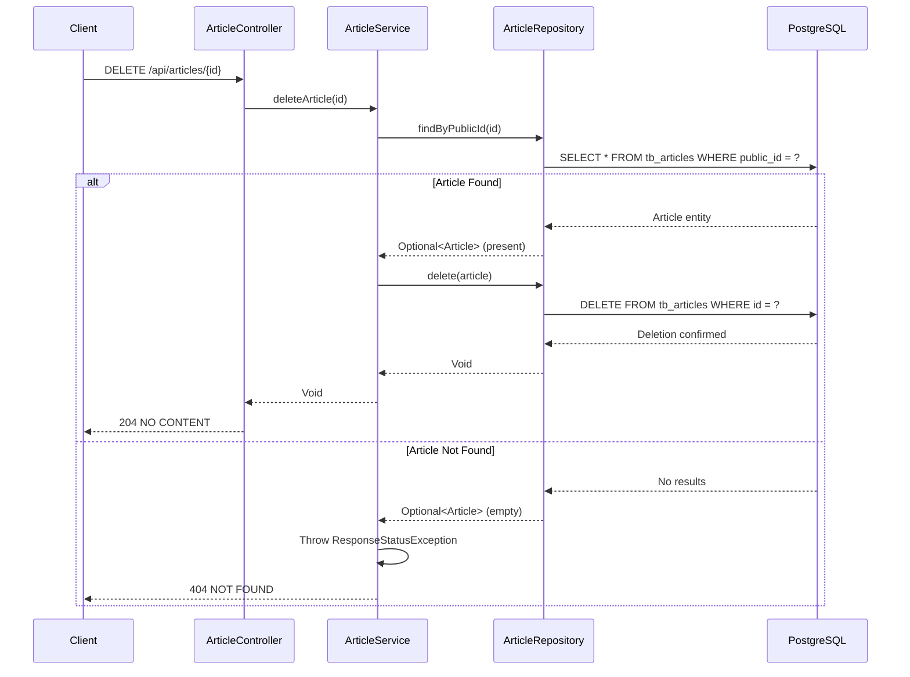
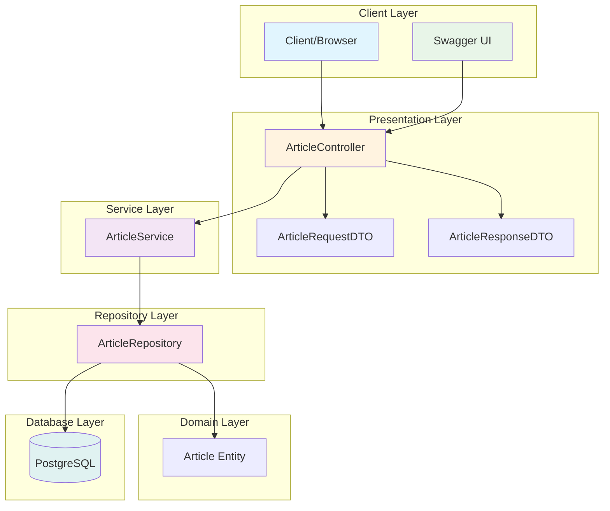
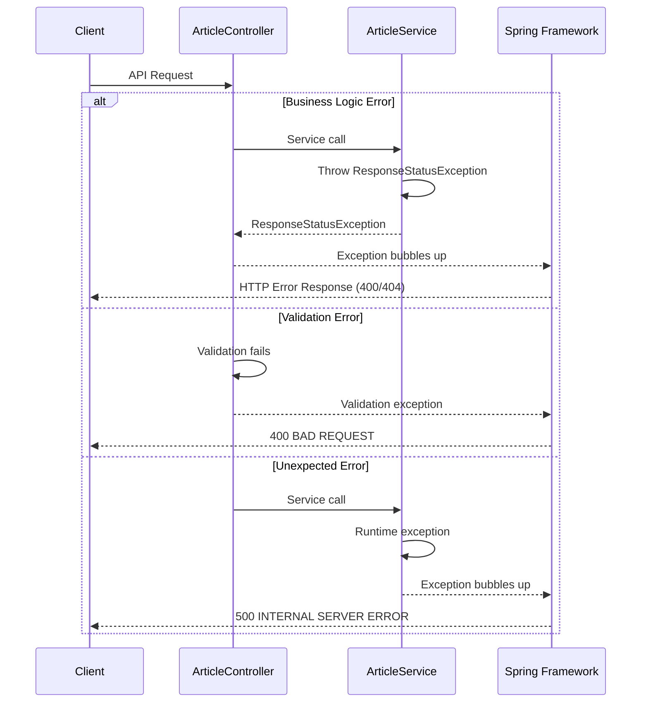
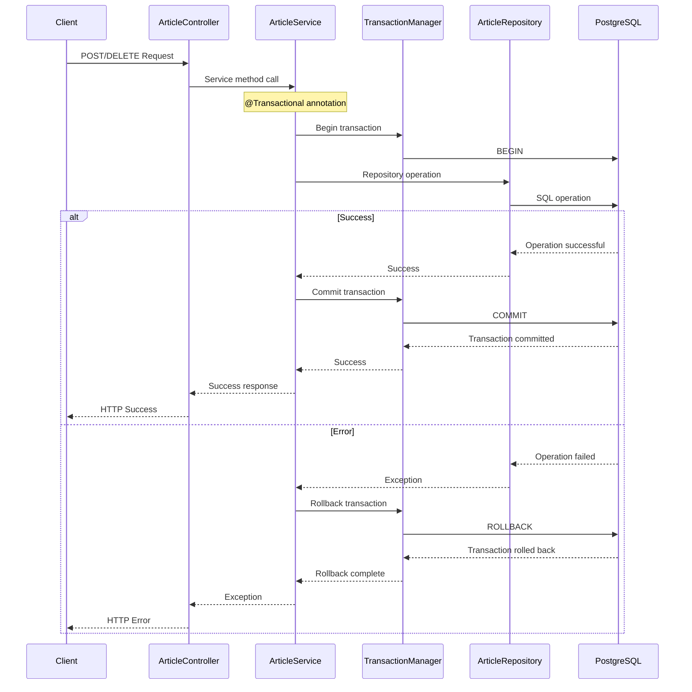

# API Sequence Diagrams

This document contains sequence diagrams that illustrate the flow of operations in the Demo CRUD API.

## Create Article Flow

## Get All Articles Flow

## Get Article by ID Flow

## Delete Article Flow

## Complete System Architecture

## Error Handling Flow

## Transaction Flow

